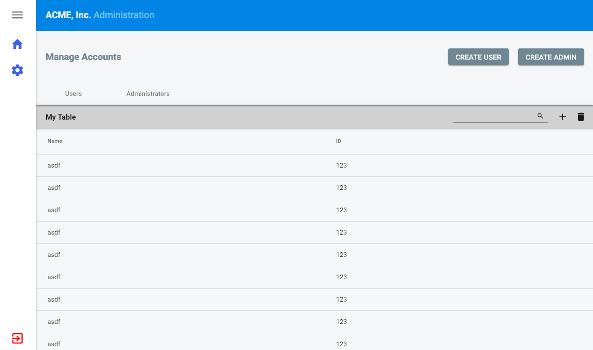

# Ngxux

Re-usable Angular 7+ User Interface Library based on Material.

# Modules

* [ngxux-mat-dialog](https://github.com/mateothegreat/ngxux-mat-dialog)
* [ngxux-mat-header-nav](https://github.com/mateothegreat/ngxux-mat-header-nav)
* [ngxux-mat-table](https://github.com/mateothegreat/ngxux-mat-table)
* [ngxux-mat-toolbar](https://github.com/mateothegreat/ngxux-mat-toolbar)
