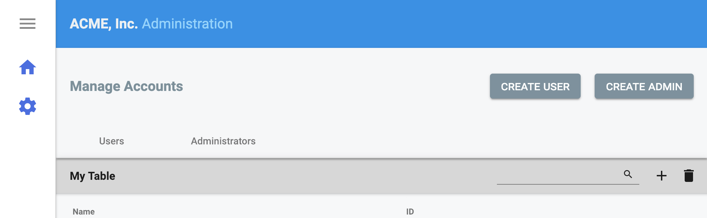

# Angular Material Page Header with Tabbed Navigation



# Example

```

<ngxux-mat-header-nav title="Manage Accounts"
                      (buttonClick)="onButtonClick($event)"
                      [buttons]="[

                            {

                                label: 'Create User'

                            }, {

                                label: 'Create Admin'

                            }

                        ]"

                      [tabs]="[

                            {

                                label: 'Users',
                                path: '/settings/assessments/manage'

                            }, {

                                label: 'Administrators',
                                path: '/settings/assessments/questions'

                            }

                        ]"></ngxux-mat-header-nav>
```
